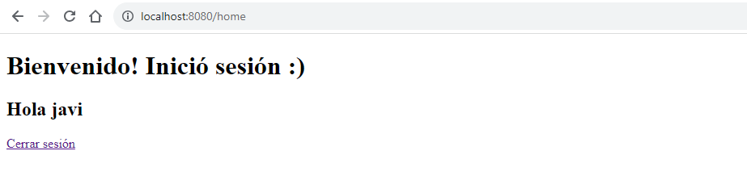
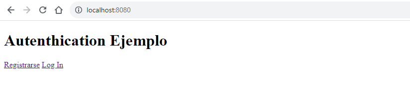
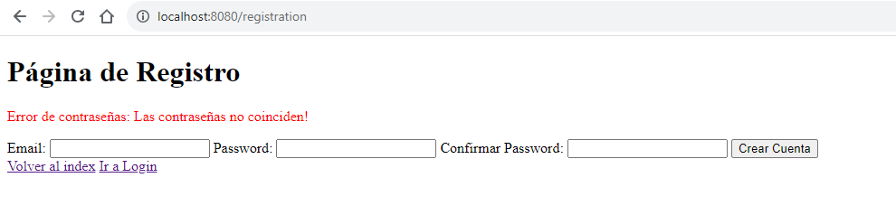
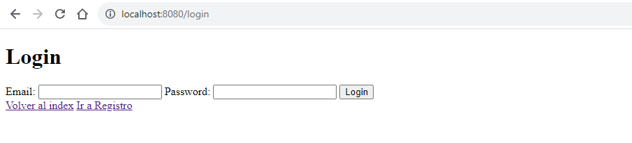
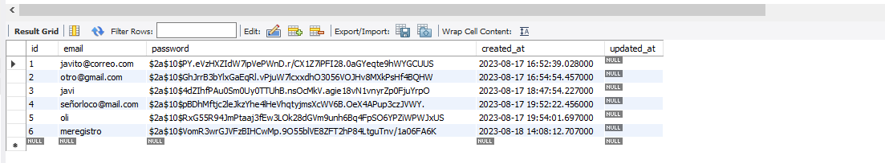

# Login y Registro de Usuarios

### Creando una tabla usuarios y opciones para poder registrars y loguearse dentro del programa.

### Características

- Hasheo de Passwords
- Registro
- Login
- Validaciones

  
  
  
  

